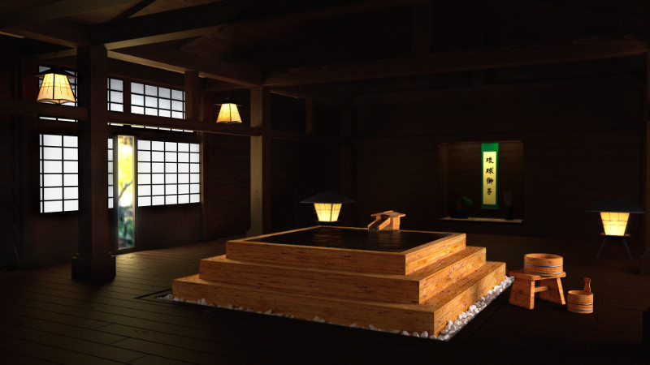

<!--
.. title: Onsen 3d rendering
.. slug: 3d-onsen
.. date: 2013/07/22 19:30:00
.. tags: 3d, blender
-->

Sometimes I can also write really, really short posts. Like this one!

I present to you, my latest (and first on Shisaa.jp) 3D rendering.

It depicts a traditional Japanese *onsen* or "hot tub", if you will.
These babies are still in use today, mostly in the more expensive (or really countryside) bathhouses.
In most of the commercial or public bathhouses, they are replaced with stone tiled versions.

The tools used for the job where, as always, Blender and Blender's Cycles rendering engine.
Post-production (though minimal) was done with the Gimp.

The render time for this one topped off at about 6 hours and a half, with a total of 1200 Cycles passes. Cheers!

Clicking on the image will give you the *Full HD* glory, so be warned.

